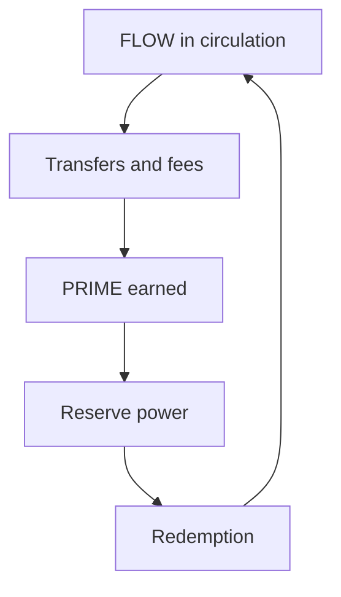

# Solidus Protocol Whitepaper

```text
Solidus

Mine the economy, not the hardware.

FLOW is used.
PRIME is earned.

Public testnet: Base Sepolia (see Live Deployment).
Short overview: docs/LITEPAPER.md
```

Version: MVP live-test draft (Base Sepolia v3)

The service-wallet and multisig mechanics described in this draft are
implemented and tested in the current source tree but require a full protocol
redeploy. The listed Base Sepolia v3 contracts predate these changes.

## Abstract

Solidus is an experimental dual-layer monetary protocol built around liquidity circulation and reserve-pressure dynamics.

The protocol separates two monetary functions:

- FLOW is the liquid settlement layer.
- PRIME is the reserve-power layer.

The core thesis is:

```text
Value is not mined.
Value emerges through circulation.

FLOW moves.
PRIME stores reserve influence.
```

Solidus is not designed as a stablecoin, proof-of-work asset, governance token, or passive yield product. The MVP goal is to test whether simple monetary mechanics can create resilient liquidity cycles under public live conditions.

For a non-technical overview, see [LITEPAPER.md](./LITEPAPER.md).

## Why Solidus?

Bitcoin mines hardware. Proof of Stake mines capital.

Solidus attempts to mine **economic participation**.

The protocol separates:

```text
FLOW  -> circulation
PRIME -> accumulation
Reserve -> pressure buffer
```

The goal is to test whether economic activity itself can become the source of scarce value — without rewarding hash power or passive stake alone.

This MVP is a launch strategy and a public experiment, not a claim of final monetary optimality.

## Economic Cycle



In plain terms:

```text
FLOW
 ↓ activity (transfers)
PRIME
 ↓ reserve power
redemption
 ↓
FLOW
```

Fees and inactivity pressure continuously refill the Reserve. PRIME emission slows as public supply fills. Redemption burns PRIME and can reopen emission headroom through the mint-burn cycle.

## System Components

The Solidity MVP contains four contracts:

- `FlowToken.sol`
- `PrimeToken.sol`
- `Reserve.sol`
- `PrimeMarket.sol`

These contracts implement three monetary states:

- active FLOW in free circulation;
- reserve FLOW held by the protocol Reserve;
- PRIME supply representing reserve-power generated from FLOW circulation.

## FLOW

FLOW is the liquid currency layer.

FLOW properties:

- ERC-20 compatible;
- fixed total supply;
- freely transferable;
- used for settlement and movement;
- standard user transfers pay a small protocol transfer fee;
- refreshes activity state on transfer.

FLOW is not designed primarily as a passive hoarding asset. Its monetary role is circulation.

### FLOW Supply Invariant

FLOW total supply is fixed:

```text
FLOW_total = FLOW_active + FLOW_reserve
```

No FLOW is destroyed. No new FLOW is inflationarily minted. FLOW only changes location:

```text
active FLOW -> reserve FLOW
reserve FLOW -> active FLOW
```

## Reserve FLOW

The Reserve is a protocol-controlled contract that holds FLOW.

The Reserve accumulates FLOW from:

- FLOW transfer fees;
- inactivity pressure;
- owner-only launch/test seeding through `seedReserve`.

User transfers directly into the Reserve are forbidden. This prevents users from donating FLOW to the Reserve in order to manipulate PRIME redemption conditions.

The Reserve can release FLOW only through PRIME redemption.

### Reserve Account Rules

Reserve is a protocol state, not a normal economic wallet:

- inactivity pressure never applies to Reserve;
- users cannot transfer FLOW directly into Reserve;
- Reserve receives FLOW only from transfer fees, inactivity pressure, and owner-only launch seeding;
- Reserve releases FLOW only through PRIME redemption;
- Reserve release pays no FLOW fee and emits no PRIME;
- Reserve cannot receive, mint, or burn PRIME on its own account;
- Reserve owner has no arbitrary FLOW withdrawal function;
- every release is bounded by the remaining per-block release budget.

## PRIME

PRIME is the reserve-power layer.

PRIME properties:

- minted only through FLOW circulation or protocol-defined genesis allocation;
- non-transferable wallet-to-wallet;
- cannot be approved through standard ERC-20 allowance;
- cannot be freely placed into PRIME/ETH or PRIME/USDT pools;
- can move only through FLOW settlement in `PrimeMarket`;
- can be burned through Reserve redemption.

The core law is:

```text
PRIME can only move through FLOW.
```

This means a user cannot send PRIME directly to another wallet. To transfer PRIME exposure, a seller places a PRIME sell order in `PrimeMarket`, a buyer pays FLOW, seller PRIME is burned, and the buyer receives newly minted PRIME in the same amount.

## Genesis Allocation

The MVP deployment mints:

```text
PRIME cap = 1,200,000,000 PRIME
founder allocation = 240,000,000 PRIME
founder allocation = 20% of cap
```

Founder PRIME is inside total PRIME supply and therefore affects total scarcity and market supply.

Founder PRIME is included in emission saturation:

```text
emission_supply = PRIME_total_supply
emission_cap = PRIME_cap
```

Therefore circulation rewards start at:

```text
emission saturation = 20%
```

This is intentional. Founder reserve power must dilute emission in the same way as all other outstanding PRIME.

## FLOW Transfer Fee

Every standard user FLOW transfer pays a protocol fee.

MVP deployment:

```text
FLOW transfer fee = 0.10%
```

The fee moves to Reserve:

```text
sender FLOW -> recipient FLOW
fee FLOW -> Reserve
```

Transfer fees serve four purposes:

- feed the Reserve;
- create anti-loop cost;
- connect movement to reserve pressure;
- make meaningless circulation non-free.

## Faucet Service Wallet

The public testnet faucet is a permanently restricted service wallet. It exists
only to distribute a predefined amount of test FLOW without changing the
economic measurements of normal circulation.

The owner multisig funds and locks the faucet atomically:

```text
fundServiceWallet(faucet, amount)
```

After registration:

- the faucet can only send FLOW out;
- all incoming FLOW transfers to the faucet revert;
- outgoing faucet distributions pay no FLOW transfer fee;
- outgoing faucet distributions emit no PRIME;
- inactivity pressure cannot be collected from the faucet;
- PRIME cannot be minted to or burned from the faucet, including by protocol operators;
- the faucet cannot buy, sell, or redeem PRIME;
- service-wallet status cannot be removed, including by the owner multisig.

The faucet must hold zero PRIME before registration. Its FLOW balance is fixed
at registration and can only decrease through outgoing distributions.

This is a testnet distribution exception, not a general fee exemption system.
Granting service-wallet status to ordinary economic actors would create a free
FLOW routing bypass and invalidate circulation measurements.

## PRIME Emission

PRIME is emitted from standard FLOW circulation.

On every non-service FLOW transfer, the sender receives a PRIME emission quote
based on eligible FLOW volume and total PRIME saturation. Faucet distributions
do not emit PRIME.

Deployment parameters:

```text
circulationRewardBps = 2000   // 20% of FLOW volume is eligible
baseEmissionBps      = 50     // 0.50% of eligible volume
saturationPower      = 1
```

Raw emission:

```text
eligible_volume = FLOW_volume * 20%
raw_PRIME = eligible_volume * 0.50%
```

Before any PRIME exists:

```text
1 FLOW transferred -> 0.001 PRIME
```

### Public Saturation Curve

Emission saturation includes all outstanding PRIME:

```text
fill =
PRIME_total_supply / PRIME_cap
```

Remaining public capacity:

```text
remaining = 1 - fill
```

Emission multiplier:

```text
saturation_multiplier = remaining
```

Final emission:

```text
PRIME_minted =
raw_PRIME * saturation_multiplier
```

At launch, founder allocation fills 20% of cap:

```text
launch emission multiplier = 1 - 20% = 80%
```

This preserves strong early emission while making all outstanding PRIME economically relevant.

### Emission Interpretation

The early phase is intentionally a Prime Rush.

Meaningless farming is not fully prevented at launch. Instead, it is made temporary:

- early PRIME is easy to earn;
- total saturation rises;
- emission efficiency decays;
- cost per new PRIME increases;
- loops become less attractive over time.

This is a launch strategy, not a final anti-bot engine.

## Reserve Redemption

PRIME can release FLOW from Reserve.

Redemption burns PRIME:

```text
PRIME burned -> FLOW released from Reserve
```

The redemption value is bounded by three layers:

- per-PRIME signal;
- pro-rata reserve backing;
- per-block release budget.

## Per-PRIME Signal

The Reserve uses two linear signals:

- active-ratio stress;
- PRIME scarcity.

The stronger signal wins:

```text
signal = max(active_ratio_stress, prime_scarcity)
```

Redemption signal:

```text
redemption_signal =
max(active_ratio_stress, prime_scarcity)
```

## Active-Ratio Stress

Active FLOW ratio:

```text
active_ratio = FLOW_active / FLOW_total
```

Deployment:

```text
maxRedeemActiveRatio = 90%
minRedeemActiveRatio = 40%
```

Stress function:

```text
if active_ratio >= 90%:
    active_ratio_stress = 0

if active_ratio <= 40%:
    active_ratio_stress = 1

else:
    active_ratio_stress =
        (90% - active_ratio) / (90% - 40%)
```

This means redemption is not controlled by a hard 58% threshold. The old threshold model has been replaced by a continuous signal.

## PRIME Scarcity

PRIME scarcity uses total outstanding PRIME supply, including founder PRIME:

```text
prime_scarcity =
1 - PRIME_total_supply / PRIME_cap
```

At genesis:

```text
PRIME_total_supply = 20% of cap
prime_scarcity = 80%
```

Therefore the scarcity signal at genesis is `80%`.

## Pro-Rata Reserve Backing

PRIME redemption starts from the pro-rata backing of a PRIME amount:

```text
pro_rata_claim =
Reserve_FLOW * PRIME_amount / PRIME_total_supply
```

Budget-free redemption floor:

```text
redeem_floor =
pro_rata_claim * redemption_signal
```

This floor is used by `PrimeMarket` to prevent PRIME sell orders below current redemption value.

## Per-Block Release Budget

Actual redemption is throttled by a block budget.

Deployment:

```text
maxReleaseBps = 250
max release per block = 2.50% of Reserve
```

Actual quote:

```text
quoteRedeem =
min(redeem_floor, remaining_block_budget)
```

If the requested PRIME amount exceeds the remaining block budget, the protocol burns only the proportional PRIME amount required for the actual FLOW release. Excess PRIME remains with the holder.

The budget exists to prevent a single transaction from draining the Reserve without causing accidental PRIME overburn.

## Launch Reserve Seeding

The deployment script seeds 50% of FLOW supply into the Reserve:

```text
FLOW supply = 10,000,000,000
initial Reserve = 5,000,000,000 FLOW
initial active FLOW = 5,000,000,000 FLOW
initial active ratio = 50%
```

This is done through owner-only `seedReserve`.

The seed:

- does not emit PRIME;
- is not a user interaction path;
- creates deep initial reserve backing;
- makes the initial PRIME floor meaningful.

At launch, active-ratio stress and scarcity are both approximately 80%:

```text
active_ratio = 50%
active_ratio_stress = (90 - 50) / (90 - 40) = 80%
prime_scarcity = 80%
redemption_signal = 80%
```

Therefore launch redemption power is approximately:

```text
pro-rata reserve share * 80%
```

subject to pro-rata reserve backing and per-block budget.

## PrimeMarket

PrimeMarket provides FLOW-settled PRIME exchange.

Seller flow:

```text
seller places PRIME sell order
buyer pays FLOW
seller PRIME is burned
buyer PRIME is minted
```

This preserves the rule:

```text
PRIME only moves through FLOW.
```

FLOW payments inside `buyPrimeFromUser` do not emit extra PRIME. This prevents P2P PRIME settlement itself from becoming a PRIME farming route.

PrimeMarket is intentionally limited to:

```text
PRIME <-> FLOW
```

It is not a generic token exchange. PRIME cannot be listed directly against ETH, USDC, USDT, or arbitrary ERC-20 tokens.

The market exposes its order list on-chain:

```text
nextOrderId
orders[id]
activeOrderIdOf[seller]
```

This avoids an off-chain database for PRIME order discovery. The backend does not need to index seller addresses to show the current PRIME/FLOW order list.

## Sell Order Floor

A seller cannot place a PRIME order below redemption floor:

```text
flowPrice >= reserve.quoteRedeemFloor(primeAmount)
```

The floor is re-validated when a buyer executes the order. This prevents stale-order arbitrage if redemption value changes between placement and settlement.

## Inactivity Pressure

Holding inactive FLOW for long periods creates reserve pressure.

Deployment:

```text
inactivity period = 30 days
inactivity pressure = 1%
```

If an account is inactive for the period, anyone can call:

```text
collectInactivityPressure(account)
```

The protocol moves a portion of that account's FLOW into the Reserve.

Purpose:

- discourage passive FLOW stagnation;
- make inactive liquidity feed reserve pressure;
- preserve the liquidity-first role of FLOW.

Regular FLOW transfers refresh activity state.

## Monetary Cycle

The intended cycle is:

```text
FLOW circulates
-> transfer fees enter Reserve
-> inactive FLOW enters Reserve
-> FLOW circulation emits PRIME
-> PRIME becomes harder to earn as total saturation rises
-> PRIME redeems Reserve FLOW
-> redemption burns PRIME
-> burn reopens emission headroom
-> FLOW returns to active circulation
```

This is a mint-burn cycle, not one-way inflation.

## Economic Phases

### Phase 1: Prime Rush

Early total saturation starts at the founder allocation and remains relatively low.

Effects:

- PRIME is easy to earn;
- FLOW movement is rewarded strongly;
- loop-like activity may be profitable;
- public distribution accelerates.

This phase is intentional.

### Phase 2: Saturation

Public PRIME supply grows.

Effects:

- emission multiplier decays;
- cost per new PRIME rises;
- meaningless loops lose profitability;
- real settlement volume becomes more important.

### Phase 3: Consolidation

PRIME is harder to earn.

Effects:

- existing PRIME holders gain reserve influence;
- FLOW remains settlement currency;
- Reserve release becomes competitive and power-weighted.

### Phase 4: Burn And Re-Emission

When PRIME is redeemed:

- PRIME is burned;
- total saturation decreases;
- emission headroom reopens;
- future FLOW circulation can mint more PRIME.

This is the self-healing mechanism that prevents cap exhaustion from becoming a permanent dead state.

## MEV And Large Holder Privilege

Reserve release is competitive.

The first redeemer in a block can consume the available block budget. This creates a first-mover advantage.

In Solidus this is treated as a property of PRIME's role:

```text
PRIME = reserve-power
more PRIME = more reserve influence
```

Large holders have structurally greater access to release opportunities.

This does not break the protocol invariants:

- it does not mint FLOW;
- it does not steal user FLOW directly;
- it does not bypass PRIME burn;
- it does not exceed the per-block budget.

But it does affect fairness:

- small users may receive worse execution timing;
- sophisticated actors can compete for budget access;
- block builders and bots may have advantage.

Solidus does not claim equal access to Reserve release.

## Known Design Trade-Offs

### Founder PRIME Supply

Founder PRIME is 20% of cap.

Trade-off:

- suppresses launch emission according to its 20% share;
- does increase total market supply;
- can create sell pressure in P2P markets.

This is not a code bug. It is an allocation and market-structure choice.

### Prime Rush Profitability

At launch:

```text
1 FLOW transfer fee cost ~= 0.001 FLOW
1 FLOW transfer emission ~= 0.001 PRIME
release value depends on reserve density, redemption signal, and block budget
```

This means early circulation can have positive reserve-backed expected value.

This is intentional bootstrap behavior. It should be described publicly as such.

### Reserve Drain Speed

`maxReleaseBps = 250` means up to 2.50% of Reserve can be released per block.

This is aggressive. It is acceptable for live testing if the goal is to observe mechanics quickly. For more conservative deployments, `25-50 bps` would make reserve release slower.

## Security Properties

Current protections include:

- PRIME direct transfer disabled;
- PRIME approval disabled;
- permanently restricted faucet service wallet;
- incoming FLOW to the faucet disabled;
- faucet fee, inactivity, PRIME mint, PRIME burn, market, and redemption paths disabled;
- FLOW direct transfer to Reserve disabled;
- PrimeMarket floor check;
- PrimeMarket settlement re-validation;
- no PRIME emission during P2P settlement FLOW payment;
- saturation power bounded;
- Reserve release budget per block;
- redemption slippage protection;
- same-block inactivity drain loop guard;
- two-step ownership transfer.

## Non-Goals

Solidus MVP does not attempt to solve:

- perfect bot detection;
- KYC;
- governance;
- oracle-based price stabilization;
- stablecoin parity;
- universal fairness across all participants;
- prevention of all speculative behavior.

The protocol provides mechanics. Social coordination, reputation, public trust, market behavior, and founder conduct remain outside the core protocol.

## Live Deployment (Base Sepolia)

v3 — enumerable PRIME/FLOW market, dual-signal redemption, 50% reserve pre-seed.

| Contract | Address | Explorer |
|----------|---------|----------|
| FlowToken | `0xBC9c05E0397Ab2C52F08a3F86a13541AC5045F60` | [Basescan](https://sepolia.basescan.org/address/0xbc9c05e0397ab2c52f08a3f86a13541ac5045f60#code) |
| PrimeToken | `0x90a0535cB8Fbe144E4b975E4ba8570760074d374` | [Basescan](https://sepolia.basescan.org/address/0x90a0535cb8fbe144e4b975e4ba8570760074d374#code) |
| Reserve | `0x7501418DbBC6fBB8a7f60BACd07b02C13786bE66` | [Basescan](https://sepolia.basescan.org/address/0x7501418dbbc6fbb8a7f60bacd07b02c13786be66#code) |
| PrimeMarket | `0xBFcA4aBD77c90E355C6e257cb619F5562c4FeD3f` | [Basescan](https://sepolia.basescan.org/address/0xbfca4abd77c90e355c6e257cb619f5562c4fed3f#code) |

Chain ID: `84532` (Base Sepolia).

Public UI: separate **`solidus-frontend`** repository. Configure the four contract addresses above in frontend `.env.local`.

### Deprecated testnet deployments

Do not use these addresses after the v3 redeploy:

| Version | FlowToken | PrimeToken | Reserve | PrimeMarket |
|---------|-----------|------------|---------|-------------|
| v2 | `0xa0279255A3465A1e050492a06eCB23Ee77Fa3877` | `0xD3fe2b908A19a66C03d0d7E64E6A46CA909770D5` | `0xd4f50053150364e0913c7caB0b12f96864C574d1` | `0xE37302f26b2a908B3d64D4cEe5D26E815c1d484f` |
| v1 | `0x136F24F4dBE9E14960104307Dc11AAab85B4B5C7` | `0xfe27ff725e47ABDa0D2c35c3cbB9538700f6C9f8` | `0xAC86181E356c326467140F2309eeae6c8fA84C03` | — |

## Deployment Parameters

MVP deployment constants:

```text
FLOW supply              = 10,000,000,000 FLOW
initial Reserve seed     = 5,000,000,000 FLOW
PRIME cap                = 1,200,000,000 PRIME
founder PRIME            = 240,000,000 PRIME
FLOW transfer fee        = 0.10%
inactivity period        = 30 days
inactivity pressure      = 1.00%
baseEmissionBps          = 50
circulationRewardBps     = 2000
saturationPower          = 1
maxClaimPerPrime         = deprecated compatibility field
maxReleaseBps            = 250
maxRedeemActiveRatioBps  = 9000
minRedeemActiveRatioBps  = 4000
```

## Conclusion

Solidus tests a simple thesis:

```text
Liquidity should move.
Stored value should emerge from movement.
Reserve power should be earned through circulation.
```

The MVP intentionally favors interpretability over anti-fraud complexity.

The system is healthy if:

- FLOW continues to circulate;
- Reserve does not become permanently frozen;
- PRIME emission saturates and reopens through burn cycles;
- loop farming becomes less attractive as total saturation rises;
- Reserve release restores active liquidity without violating FLOW supply invariance.

The live test should be evaluated as an economic experiment, not as a finished monetary system.
